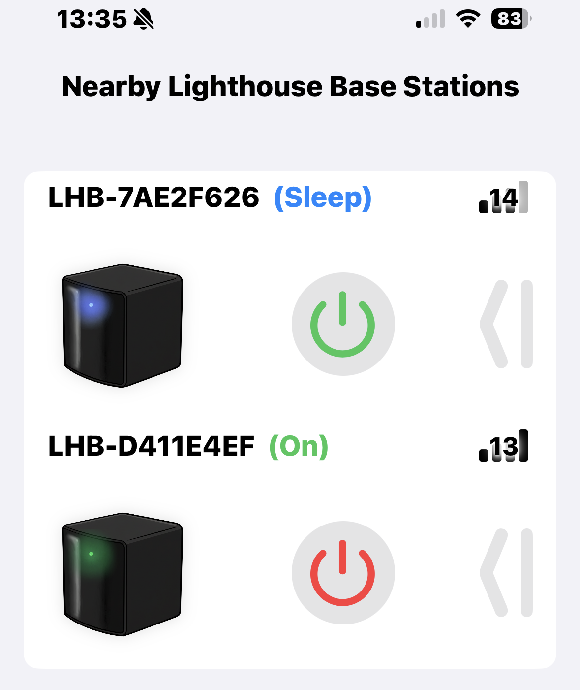
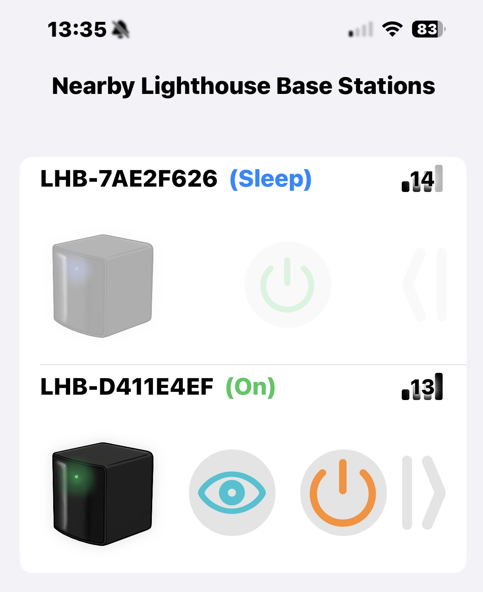

# iLighthousePowerManagement

A native **iOS application** built with **SwiftUI** and **Core Bluetooth** for discovering, monitoring, and controlling the power state of **Valve Lighthouse Base Stations V2**
---

## Usage

When you launch the app, it automatically begins scanning for nearby **Lighthouse Base Stations**.
Each detected device appears on the home screen :

### Interacting with a **Lighthouse Base Stations**

With each device, you can
- tap the power button to **Power On** / **Power Off** the base station
- long press the power button to set the base station to **Standby** or **Sleep** depending on the current state.

You can also swipe the device section to access **Advanced controls**  where you will get control for :
- **Identify** — Makes the base station blink its white LED so you can find it.
- use the dedicated **Standby** Button

## Features

### Automatic Discovery
Scans for and identifies nearby Lighthouse Base Stations (`LHB-XXXXXXXX`) using **Bluetooth Low Energy (BLE)**.

### Power Control
Allows switching the base station's state between:
- **On**
- **Standby**
- **Sleep (Off)**

### Identify Function
Triggers the base station's **white LED blink** feature to help locate a specific unit physically.

### Status Monitoring
Shows real-time device information:
- Connection Status
- Current Power State
- Signal Strength (and BLE channel)

### Background Management
Optimizes battery life by:
- Disconnecting devices when the app enters background
- Stopping BLE scans

---

## Technical Architecture

### 1. **Core Bluetooth Management** (`LighthouseBLEManager.swift`)

The central logic hub for all Bluetooth interactions, conforming to
`CBCentralManagerDelegate` and `CBPeripheralDelegate`.

**Discovery**
- Devices are matched using a regex:
  `^LHB-[A-F0-9]{8}$`

**Communication**
- Uses Lighthouse BLE characteristic UUIDs:
  - **Power State** — `00001525-1212-EFDE-1523-785FEABCD124`
  - **Channel** — `00001524-1212-EFDE-1523-785FEABCD124`
  - **Identify Command** — `00008421-1212-EFDE-1523-785FEABCD124`

---

### 2. **User Interface** (`ContentView.swift` & `LighthouseRow.swift`)

Built with **SwiftUI** using reactive update patterns.

**Device Lifecycle**
- Each `LighthouseRow` manages the connection lifecycle.
- Includes a **30-second cleanup timer** that removes a device when it remains disconnected.
- Timer pauses intelligently via `@Environment(\.scenePhase)` when the app goes to background.

**Control Interaction**
- Power commands (`.on`, `.standby`, `.sleep`) are sent via
  `setBaseStationPower()` in the BLE manager.
- Identify action includes a **20-second delayed UI reset**

---

### 3. **Debugging** (`Debug.swift`)

A custom debugging utility featuring:

- Thread-safe logging to console **and** in-app buffer
- Log filtering (`debug`, `info`, `warning`, `error`)
- `DebugOverlay` SwiftUI view showing real-time logs on device (in debug builds)

---

## How to build with xtool

run `xtool dev run -c release` to build and install on a connected iPhone
run `xtool dev run -c debug` to enable debug logs in the App

check https://xtool.sh/tutorials/xtool/ for full xtool setup.

---